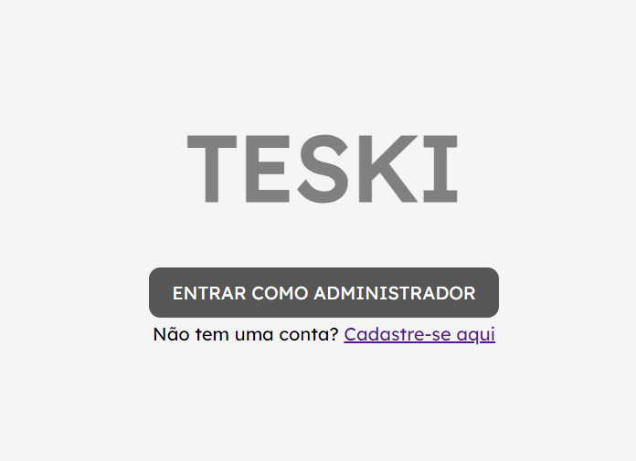
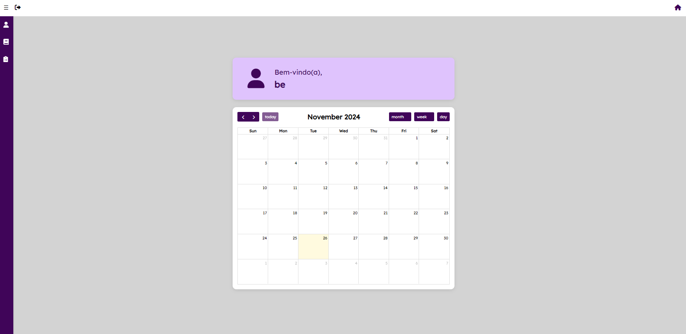
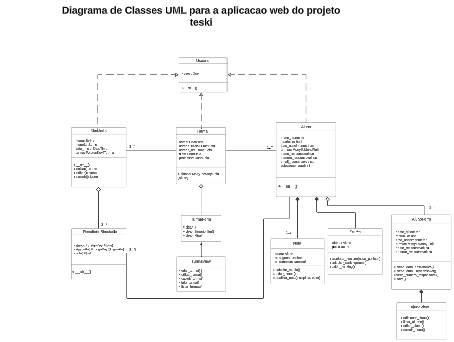

# 
TESKI

  Bem-vindo(a) ao repositório do projeto TESKI! Nosso objetivo é oferecer uma solução inovadora para empresas do setor educacional, focada na melhoria da logística e manipulação de informações e dados.

  Aqui você encontrará todas as informações necessárias para entender o processo de desenvolvimento do TESKI, uma aplicação desenvolvida para otimizar o gerenciamento logístico de nossa empresa cliente no setor educacional.

---

 

## 🔍 Visão Geral

O projeto TESKI foi desenvolvido para o Bem Curso Preparatório com o objetivo de gerenciar de forma eficiente alunos, turmas e notas. Utilizando o framework Django, o TESKI permite à administração escolar acompanhar o progresso dos estudantes, organizar turmas e atribuir notas de maneira automatizada e simplificada.

Essa aplicação foi criada para atender às necessidades específicas do cliente, proporcionando uma solução moderna que otimiza o gerenciamento de dados e a logística do curso, facilitando o controle sobre o desempenho acadêmico e a organização interna.

---
## 📲 Links importantes
<ul>  
  <li>
    <a  href="https://docs.google.com/document/d/1R-R_4VmsdZTgfQcPmBP5bP-mG8D3Xw1xR1zSA8L4NbQ/edit?usp=sharing"
      >Docs - Relatorio da programação em par </a
  </li>
  <li>
    <a  href="https://lucid.app/lucidchart/00180eab-53c7-4d31-9a18-9e9661c408cc/edit?view_items=YCzud~_PgDN3&invitationId=inv_4c918876-b716-4ccd-b4d4-9e2f85162ba8"
      >Lucidspark - Diagrama de classes UML</a
  </li>
  </li>
    <li> 
      <a  href="https://www.notion.so/MENU-b8593595ca4a4ed28b27d01f7124e5be?pvs=4"
      >Notion - Notas e documentação </a  
  </li>
     <li>     
       <a  href="https://www.notion.so/MENU-b8593595ca4a4ed28b27d01f7124e5be?pvs=4"
      >Figman - Protótipo de baixa </a
  </li>
    </li>
    <li>
     <a  href="https://miro.com/welcomeonboard/V1ducjBMRk5OSzcxNFBEc2NYRFBmOEpsR1RFMDh2NmExOXBkdDV4SFdlb3A2Skg0SWFmT3JiS2N2Y1pSa09CanwzNDU4NzY0NTYyMzcwOTAzNjE1fDI=?share_link_id=537364375015"
      >Miro - Projetos e ideação </a
  </li>
    <li>
      <a  href="https://trello.com/invite/b/66ea030e0cf26d2fc959e030/ATTI46a074c07e4dce24da4468e37e2adb82CA84158F/g9"
      >Trelo - Quadros Kanban</a
  </li>

  
---

## ✅ Status Report 1

<h2><b>SPRINT 1</b></h2>

 

### 💻 Screencast Aplicação Web 01

  

 Clique na imagem para ser redirecionado para o vídeo 

### 📈 Diagrama de classes UML 01

  

 Clique na imagem para ser redirecionado para o site 

 

## ✅ Status Report 2

### 💻 Screencast Aplicação Web 02

  

 Clique na imagem para ser redirecionado para o vídeo 

### 📈 Diagrama de classes UML 02

  

 Clique na imagem para ser redirecionado para o site 

 

## 🚀 Nossa Equipe

- **Silvio Fittipaldi** (sfm@cesar.school)(CC)
- **Bernardo Heuer** (bchg@cesar.school)(CC) 
- **Luís Felipe** (lfpb@cesar.school)(CC)
- **Lucas Santos** (lsc7@cesar.school)(CC)
- **Erick Belo** (eab2@cesar.school)(CC)
- **Eduardo Roma** (erca@cesar.school)(CC)
- **Rodrigo Barreto** (rbnm@cesar.school)(CC)
- **Amanda Lima** (amsl@cesar.schhol)(Design)
- **Maria Betânia** (mbsraa@cesar.school)(Design)
- **Beatriz Bogater** (btb@cesar.school)(Design)
- **João Gabriel** (jglx@cesar.school)(Design)

---
